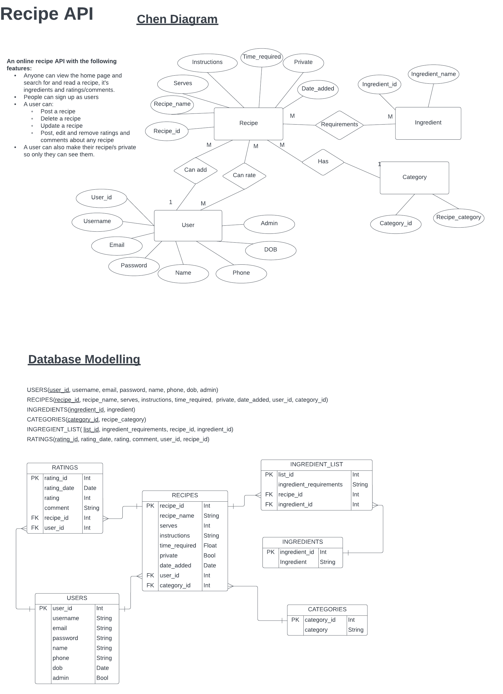

# T2A2 - API Webserver Project    

**Name:** Wade Doolan  
**Student number:** 12678     

<hr>  

## R1 Identification of the problem you are trying to solve by building this particular app.  

Recipes are often written on sheets of paper or in books. Books and paper can degrade over time and are easily lost. This API was designed to provide a secure place to store and share your favourite recipes. 

<hr>  

## R2 Why is it a problem that needs solving? 

My mother-in-law is a fantastic cook but never documents her recipes or has lost a lot of them over time. When we ask her how she made a particular meal she can never remember. I thought it would be good for her and for us if she could save her recipes online, so she never forgets, and we can access the information when we want to cook the same meal. Essentially, this API can be used by other people who want to share their recipes with others and/or save their recipes in a safe place, so they can always access them.


<hr>  

## R3 Why have you chosen this database system? What are the drawbacks compared to others?

### Reason for using PostgreSQL  

The PostgreSQL relational database management system (RDBMS) was chosen for this application for the following reasons:
- It's free, open source and has a lot of community support.
- It can run on all operating systems.
- Allows user-defined data types along with primitive data types.
- Uses Structured Query Language (SQL) and is well suited to storing relational data.
- Works with any programming language, including python.
- Is ACID compliant meaning:  

    - Atomicity: database transactions are fully completed, or they fail.
    - Consistency: data consistency is ensured since changes are rolled back when a transaction fails.
    - Isolation: ensures transactions are kept separate, with previous transactions completed before the next is allowed to e processed.
    - Durability: meaning the database can be rolled back to a previous state in the case of a server failure.

- PostgreSQL also supports JSON and flexible text searching capability.

(Digitalocean.com 2019; EDUCBA 2019; IONOS Digital Guide 2022)


### Drawbacks   

Unfortunately, not all hosting sites support PostgreSQL (IONOS Digital Guide, 2022). Moreover, query speed can be slower than some other database management systems. For example, other NoSQL databases systems might offer faster speeds, as the relational structure of a PostgreSQL can make query speed slower, especially with large amounts of data. Also, adding new fields to a PostgreSQL database can be complicated in some cases, making changes a little more difficult compared to other systems like MongoDB. Although, PostgreSQL is free and open source, it doesn't come with a warranty or liability protection like some proprietary systems do (Stuti Dhruv, 2019).


<hr>  

## R4 Identify and discuss the key functionalities and benefits of an ORM.  

An object-relational mapper (ORM) provides a layer between object-oriented programming code and relational databases, with the aim of allowing developers to interact with the underlying database without needing to write raw SQL (Liang, 2021). The SQLAlchemy library is an example of an ORM that allows a python program to communicate with a relational database, like PostgreSQL. Essentially, the ORM is responsible for shifting data between objects and a database, while ensuring the objects and database tables remain independent (Krebs, 2017).    

### Key functionalities 

Using Python and the SQLAlchemy ORM as an example, an ORM has the following key functions: 

- **Model declaration:** This involves using Python code to write classes that define both Python objects and database table metadata all at the same time. Effectively creating a blueprint of the objects and associated database table structures using Python classes.   
- **Relationship building:** This involves expanding the model declaration above and adding foreign key constructs to the relevant tables to indicate relationships between objects and the mapped tables to be created in the underlying database. A relationship function is used to indicate relationship direction and how rows of data should be dealt with when related data from another table is deleted.    
- **Instantiation of mapped classes:** Once all the relevant objects are mapped to their corresponding database tables, the ORM allows developers to instantiate the objects the same why any object is instantiated in an object-oriented programming language. For example: ``` User(colname=data, colname=data, ...) ```    
- **Querying data:** An ORM facilitates data querying using methods and functions, in place or SQL. For example, ``` query.filter(User.name == 'ed')``` is the same as ``` SELECT * FROM USERS as a WHERE a.name = 'ed'; ```  
- **Sessions including committing:** Data is added, updated and deleted from the associated database using the session object. This object contains the add(), delete() and commit() methods, among others. Ultimately, the session.commit() method executes the associated SQL after a session.add() or session.delete() has been called.  

(Sqlalchemy.org, 2022).   

### Benefits of an ORM  

The benefits associated with ORMs include:  

- ORM queries can be written regardless of the particular relational database used for the backend. If the applications needs to migrate to another database, there is no need to re-write the existing ORM queries. 
- Reduces the need for the developer to know the exact syntax of the underlying SQL.   
- ORMs can be used for any object-oriented programming languages, so they are not confined to only a few specific languages.

(EDUCBA, 2020)

<hr>  

## R5 Document all endpoints for your API.


<hr>  

## R6 An ERD for your app.

The Entity Relationship Diagram for the recipe API is shown below: 

Please note, this ERD can also be accessed online here: https://lucid.app/lucidchart/7c50beef-7db7-450e-86e9-3842b93b88d5/edit?viewport_loc=-77%2C-179%2C1729%2C1159%2C0_0&invitationId=inv_71615ea1-65e1-4a71-8844-eb8556fd56f8# 




<hr>  

## R7 Detail any third party services that your app will use.  

<!-- list external data sources here -->


## R8 Describe your projects models in terms of the relationships they have with each other.

The recipe API has the following models:

- Recipe  
- User  
- Rating  
- Ingredient  
- IngredientList  
- Category  


### Recipe model 

The API's Recipe model represents a parent object that is related to children models, IngredientList and Rating. 

- There can be many IngredientList objects related to one Recipe object. An IngredientList object can be deleted without needing to remove the associated Recipe object. However, if a Recipe object is deleted, then all associated IngredientList objects need to be deleted.

- There can be many Rating objects related to one Recipe object. A Rating object can be deleted without needing to a related Recipe object. However, if a Recipe object is deleted, then all associated Rating objects need to be deleted.  

The Recipe model also represents a child object that is related to the User and Category models. 

 - There can be many Recipe objects related to one User object. A Recipe object can be deleted without needing to remove the associated User object. However, if a User object is deleted, then all associated Recipe objects need to be deleted.

 - There can be many User objects related to one Category object. A Recipe object can be deleted without needing to remove the associated Category object. However, if a Category object is deleted, then the associated Recipe object can remain as it is not necessary for the Recipe object to have a Category linked to it.  

 ### User model  

 The User model represents a parent object related to children models, Recipe and Rating. 

- As mentioned above, the User model has a one-to-many relationship with the Recipe model. 


<hr>  

## R9 Discuss the database relations to be implemented in your application.
<!-- Refer to the ERD and discuss using one to many language -->


<hr>  

## R10 Describe the way tasks are allocated and tracked in your project.

<!-- link to trello -->

<hr>  


